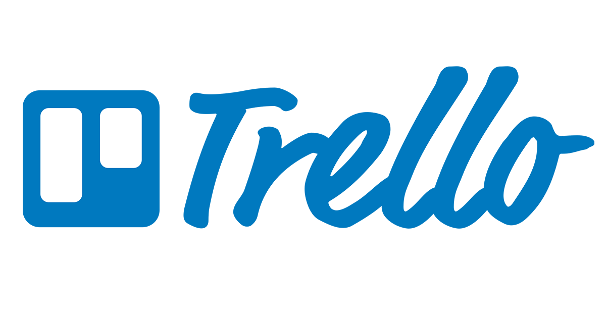
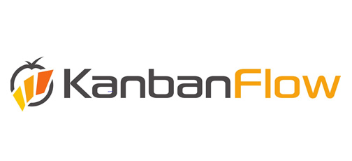
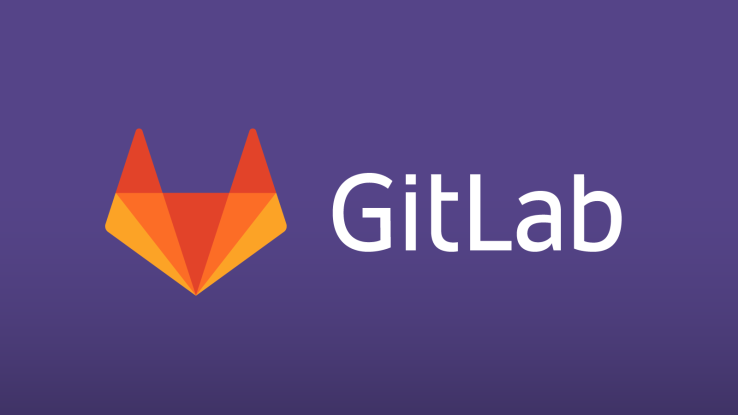
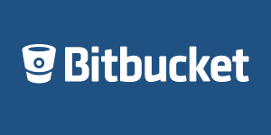

# Practica_1

## Describir dos alternativas para Slack:

[**Slack**](https://slack.com/intl/es-es/lp/three?utm_medium=ppc&utm_source=google&utm_campaign=d_ppc_google_es_es_brand-hv&utm_term=slack&ds_rl=1249094&gclid=Cj0KCQiA7OnxBRCNARIsAIW53B8trJmGcsh0xr6I-4EvOS4FYR7g3_izikxPYuorKyh5bK-0CIzafIEaAqm2EALw_wcB&gclsrc=aw.ds) es una herramienta de comunicación en equipo​y surgió con el nombre de Dharma​ creada por Stewart Butterfield​, Eric Costello, Cal Henderson, y Serguei Mourachov.

Podemos encontrar varias alternativas de uso parecido a ésta:

- [Bitrix24](https://www.bitrix24.es/) es una de las alternativas a Slack más directas, ya que es una aplicación dedicada a grupos reducidos y pequeñas empresas que ofrece la posibilidad de realizar proyectos en equipo, facilitando enormemente la comunicación entre sus integrantes. La función más destacada de Bitrix24 es la que nos permitirá realizar videollamadas individuales y grupales, las cuales nos ayudarán a coordinar tareas, realizar exposiciones de ideas y presentaciones de proyectos. También podemos compartir archivos desde una cuenta común, permitiendo que cualquier usuario pueda acceder a esos documentos debido a la excelente sincronización que nos ofrece la herramienta.
Posee una aplicación de escritorio disponible para múltiples plataformas, desde la cual se podrán hacer las videollamadas y se podrán enviar mensajes de textos. También hay versiones para dispositivos móviles iOS y Android.
Existe una versión gratuita, aunque con ciertos límites ya que podremos tener un equipo de hasta 12 integrantes y podremos almacenar en la nube hasta 5 GB de información. Luego existe un plan de $99 dólares al mes que ofrece 100 GB de almacenamiento, y existe otro plan de $199 dólares al mes con una capacidad ilimitada de almacenamiento.


- [HipChat](https://www.atlassian.com/es/software/hipchat/downloads) es una de las alternativas a Slack más económicas y con mejores prestaciones. Se trata de una aplicación completa, la cual ofrece diferentes planes que se ajustan a las necesidades de cada diferente tipo de empresa. Ofrece un chat privado y grupal, mediante el cual podremos mantenernos comunicados constantemente con los integrantes de nuestro equipo. También podremos hacer uso compartido de los archivos que seleccionemos. La transferencia de archivos ilimitada y la encriptación SSL de 256 bits.Interfaz sumamente clara y fácil de manejar para cualquier persona, lo cual facilitará y agilizará las tareas en equipo. 
Es una aplicación multiplataforma que podremos utilizar desde Mac, Linux Windows, navegadores web e incluso desde dispositivos móviles con iOS y Android.
Ofrece un plan gratis con 5 GB de almacenamiento y 25 mil mensajes de búsqueda. Luego nos ofrece un plan de $2 dólares mensuales con un historial de búsqueda ilimitado y con una capacidad de almacenamiento sin límites.


## Describir dos alternativas para Trello

Trello es una herramienta de gestión de proyectos que hace que la colaboración sea sencilla e incluso divertida.
Podemos encontrar varias alternativas de uso parecido a ésta:

-KanbanFlow: es un tablero que permite organizar tu trabajo de forma visual, además de simplificar la comunicación en equipo para aumentar la productividad.
Los tableros se organizan de forma vertical y a cada tablero le puedes añadir diferentes columnas en las que puedes añadir tarjetas con colores y miembros de equipos asignados, también puedes añadir tareas y subtareas.
La diferencia frente a Trello, Trello no consigue añadir un límite de tareas a una columna para mantener algunos proyectos más enfocados y no abusar de multitareas. Permite seleccionar las tarjetas por color, etiqueta, usuario o fecha de vencimiento. Tiene cuentas con integración con Dorpbox, Box y Google Drive.

-Archmule: es una alternativa simplificada a Trello, funciona de la misma manera, un gran tablero con columnas que puedes arrastrar diferentes tareas en forma de tarjetas. También tiene una página de inicio en la que se muestra el resumen con lo más importante de cada actualización de cada equipo o proyecto.
Con Archmule puedes crear proyectos privados o públicos y compartirlos, es bastante social, los tableros ofrecen la opción de “seguir” o dar “me gusta”, además tienes un espacio para conversar con los miembros de cada tablero, “hub” que es un mini chat.

## Alternativas a GitHub

Lo primero de todo es saber qué es GitHub, es una compañía sin fines de lucro que ofrece un servicio de hosting de repositorios almacenados en la nube. Esencialmente, hace que sea más fácil para individuos y equipos usar Git como la versión de control y colaboración.
La interfaz de GitHub es bastante fácil de usar para el desarrollador que quiera aprovechar las ventajas del Git. Sin GitHub, usar un Git generalmente requiere de un poco más de conocimientos de tecnología y uso de una línea de comando.
Además de esto, cualquier persona puede inscribirse y hospedar un repositorio de código público completamente gratuito, el cual hace que GitHub sea especialmente popular con proyectos de fuente abierta.

- Gitlab es un servicio web de control de versiones y desarrollo de software colaborativo basado en Git. Además de gestor de repositorios, el servicio ofrece también alojamiento de wikis y un sistema de seguimiento de errores, todo ello publicado bajo una Licencia de código abierto.
La principal ventaja que tiene GitLab es el hecho de ser software libre, estando su código publicado bajo MIT. Esto permite que pueda ser bifurcado y reimplementado en un servidor propio. Por otro lado, su interfaz y forma de funcionar son similares a los de GitHub, aunque con el añadido de que permite crear repositorios privados de forma gratuita, puede venir muy bien si no estas interesado en exponer tu código y no quieras pagar por ello.
Otras características son la posibilidad de migrar fácilmente desde GitHub (algo que muy posiblemente sea potenciado a partir de ahora) y los planes de pago para aquellos que no quieran invertir en un servidor propio.

- Bitbucket es otra alternativa bastante interesante para alojar código. Perteneciente a la empresa Atlassian, es privativo, aunque permite crear repositorios privados de forma gratuita, además de soportar la importación desde GitHub.
Según sus planes, es gratuito para equipos de hasta cinco miembros, por lo que puede venir bien como punto de partida y luego pasar a los planes de pago una vez que el proyecto o la empresa hayan aumentado de tamaño.
Bitbucket es un servicio de alojamiento basado en web, para los proyectos que utilizan el sistema de control de versiones Mercurial y Git. Bitbucket ofrece planes comerciales y gratuitos. Se ofrece cuentas gratuitas con un número ilimitado de repositorios privados (que puede tener hasta cinco usuarios en el caso de cuentas gratuitas) desde septiembre de 2010,1 los repositorios privados no se muestran en las páginas de perfil - si un usuario sólo tiene depósitos privados, el sitio web dará el mensaje "Este usuario no tiene repositorios". El servicio está escrito en Python

